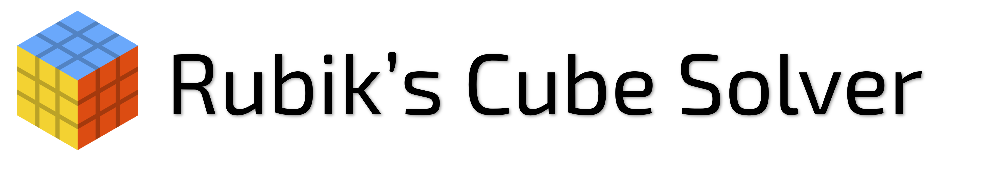
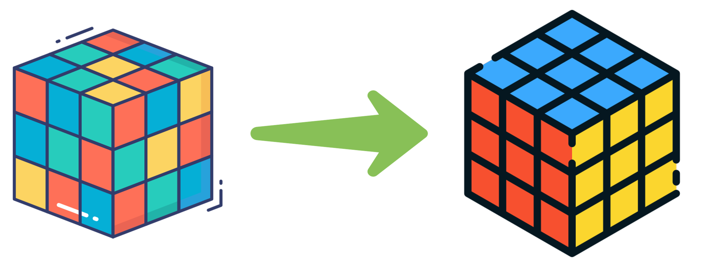

<br>


---


<b>A collection of Rubik’s Cube solvers implemented with different algorithms and models. This project showcases multiple cube representations and search strategies to solve any given cube configuration.</b>

---

## 📦 Rubik's Cube Models

- 🧊 **3D Array**: `6 x 3 x 3` — Traditional face-based cube representation
- 🧱 **1D Array**: Linearized form of the 3D array (`size = 54`)
- 🧠 **Bitboard**: `array<bitset<27>, 6>` — Each `bitset<27>` represents a face; every 3 bits encode a color on a square

### Orientaion, Face layout and Indexing of Cube : (Used for all models)

```aiignore
Face view (after opening) :

        U             0
      L F R B  ---> 1 2 3 4
        D             5
        
Face view (Color) :
             [U Face - 0]
               W  W  W
               W  W  W
               W  W  W

[L Face -1]  [F Face -2]  [R Face -3]   [B Face -4]
  G  G  G      R  R  R      B  B  B      O  O  O
  G  G  G      R  R  R      B  B  B      O  O  O
  G  G  G      R  R  R      B  B  B      O  O  O

             [D Face - 5]
               Y  Y  Y
               Y  Y  Y
               Y  Y  Y

Index of Cells(useful for bitBoard model) :
             [U Face - 0]
               0  1  2
               3  4  5
               6  7  8

[L Face -1]  [F Face -2]  [R Face -3]   [B Face -4]
  0  1  2      0  1  2      0  1  2      0  1  2
  3  4  5      3  4  5      3  4  5      3  4  5
  6  7  8      6  7  8      6  7  8      6  7  8

             [D Face - 5]
               0  1  2
               3  4  5
               6  7  8
```

---

## 🚀 Algorithms Implemented

### 🔍 DFS – Depth-First Search (Limited Depth)

A simple yet powerful solver that explores paths deeply before backtracking.

<details>
<summary><strong>📘 Read more about how DFS works in this project</strong></summary>

#### 📌 Overview

The DFS-based solver takes an initial scrambled Rubik’s Cube and performs a **depth-first search** to reach the solved state.

However, DFS is prone to:
- Diving too deep into one path
- Failing to return a result in reasonable time
- Producing unnecessarily long solutions

To overcome this:
> We **limit DFS to a max depth of 20 moves**, based on **God’s Number** — every Rubik's Cube can be solved in 20 moves or fewer.

This max depth is configurable as a **hyperparameter**, useful for experimentation.

─────────────────────────────────────────────────


#### ⚠️ Pitfalls: When DFS Fails Unexpectedly

Sometimes, the DFS solver fails **even when the solution exists within the depth limit**.

Example:
- You apply `6` random moves to scramble the cube.
- You set `DFS max depth = 7 or 8`.
- ❌ The solver fails to find a solution!

This shouldn't happen. Why does it?

─────────────────────────────────────────────────

### 🤯 The Core Problem

This happens due to the **interaction between two constraints**:

1. **Visited Map** – Prevents re-exploration of already seen nodes
2. **Max Depth** – Limits how deep DFS can go

**Issue:**
- Solver explores a state via a **longer path** → marks it visited
- Hits the max depth → backtracks
- Later, a **shorter path** leads to the same state → skipped due to "visited"
- ❌ The better path is ignored, and no solution is found

### ✅ Solution: Remove the Visited Map

By **disabling the visited-node tracking**, the solver can:
- Revisit nodes via different paths
- Explore shorter, more optimal solutions
- Guarantee a valid result if it exists within depth limit

Yes, this increases computational complexity, but it ensures **correctness**.

─────────────────────────────────────────────────

### 🧠 Key Takeaways

- DFS may fail due to premature pruning with visited maps
- Removing the visited map allows complete exploration
- Correctness > Performance for DFS in this case

─────────────────────────────────────────────────
### 🔍 Algorithm Steps

Both `solve()` and `solve_rand()` use a recursive **depth-first search** to explore cube states. The difference is:
- `solve()` applies all 18 moves in fixed order.
- `solve_rand()` shuffles the moves at each depth to introduce randomness.

─────────────────────────────────────────────────

#### 🧠 DFS – Deterministic Version (`solve()`)

1. Start with the initial cube.
2. Begin a recursive DFS from depth = 1.
3. If cube is solved → return `true`.
4. If depth exceeds `max_depth` → return `false`.
5. Loop over all 18 possible moves (0 to 17):
    - Apply move to cube.
    - Append move to `solution`.
    - Recurse to next depth: `dfs(cube, depth + 1)`
    - If recursion returns `true`, bubble up.
    - Else, backtrack:
        - Pop move from `solution`
        - Invert the move on the cube.
6. If all moves fail to solve within `max_depth`, return `false`.

─────────────────────────────────────────────────

#### 🎲 DFS – Randomized Version (`solve_rand()`)

1. Similar to deterministic DFS, but:
2. Before each depth, shuffle the 18 moves randomly using a seeded PRNG (`mt19937`).
3. Apply moves in randomized order (for better coverage in multiple runs).
4. Recursion and backtracking logic is the same.
5. Can produce different solutions on each run, useful in puzzles with many short solutions.

─────────────────────────────────────────────────

#### 🔁 Why Randomized?

Randomization helps in cases where:
- A short solution exists but is buried behind a specific move order.
- The deterministic DFS misses it due to fixed move priority.
- Running randomized DFS multiple times increases chance of hitting a short path.

─────────────────────────────────────────────────

#### 📝 Pseudocode

```cpp
bool dfs(cube, depth):
    if cube is solved: return true
    if depth > max_depth: return false

    for move in [U, U2, U', ..., B']:
        apply move
        add move to solution
        if dfs(cube, depth+1): return true
        undo move (invert)
        remove move from solution

    return false

```

</details>

---

### 🔁 ID-DFS – Iterative Deepening DFS

Combines the memory efficiency of DFS with the optimality of BFS by increasing depth limits iteratively. Details available in the respective module.
<details>
<summary><strong>📘 Read more about how IDDFS works in this project</strong></summary>

#### 🔄 Why not just DFS or BFS?

- **DFS**:
    - Low memory usage: `O(depth)`
    - May explore long paths unnecessarily
    - May miss shorter/optimal solutions early

- **BFS**:
    - Guarantees shortest path
    - High memory usage: `O(n)` (can be infeasible for large state spaces like Rubik’s Cube)

---

#### 💡 What is IDDFS?

**Iterative Deepening DFS (IDDFS)** solves this by running **DFS repeatedly with increasing depth limits**:

> DFS with depth = 1  
> DFS with depth = 2  
> ...  
> DFS with depth = D (until solved)

Each iteration restricts DFS from exploring deeper than the current limit.

This allows:
- Low memory usage like DFS
- Early discovery of shallow solutions like BFS

Similar to DFS, it also has an option to use random DFS(all moves are tried in random order) instead of plain DFS(All moves are tried in order).

---

#### 🔄 Repeated Visits Are Okay!

Yes, **upper levels are re-visited** multiple times:

- Bottom level visited once
- Second-last level twice
- And so on...

This sounds inefficient, but in most search trees (including Rubik’s Cube), **the majority of nodes lie in the bottom levels**, so repeated top-level visits aren't costly in practice.

---

### 🧠 Summary

- ✅ Optimal like BFS
- ✅ Space-efficient like DFS
- 🔄 Repeats DFS with increasing depth
- 🧩 Ideal for large state spaces like Rubik’s Cube

👉 You can learn more about IDDFS here:  
[Wikipedia – Iterative Deepening DFS](https://en.wikipedia.org/wiki/Iterative_deepening_depth-first_search)

</details>

---

### 🔄 BFS – Breadth-First Search

Searches level-by-level and guarantees the shortest solution. Memory-intensive but optimal.

<details>
<summary><strong>📘 Read more about how BFS works in this project</strong></summary>

### 🧠 Why BFS?

**Breadth-First Search (BFS)** explores states **level by level**, starting from the root. It **guarantees the shortest sequence of moves** to solve the cube.

> No need to define a max-depth — it automatically finds the solution in ≤ 20 moves.

---

### 📐 How is BFS implemented?

The BFS solver uses:

- `queue<M>` — Standard queue for level-order traversal
- `unordered_map<M, bool, H>` — Visited map with a **custom hash function** for the cube model
- `unordered_map<M, move, H>` — Parent map to backtrack solution

Where:
- `M` is the cube model (3D/1D/Bitboard)
- `H` is a user-defined hash function for the chosen model

---

### 🔍 Algorithm Steps

1. Start with initial cube in queue, mark as visited.
2. While queue is not empty:
    - Pop the current state.
    - If solved → done!
    - Else, apply all 18 moves to create new states.
    - For each new state:
        - If not visited:
            - Mark visited
            - Save parent move
            - Push to queue
3. Once goal is reached, use `parent` map to **reconstruct solution** backward.

#### 📝 Pseudocode
```cpp
Initialize queue q
Initialize visited map
Initialize parent map to reconstruct the path
    
BFS_Solver(rCube):

    Push rCube to q
    Mark rCube as visited

    while q is not empty:
        rk = q.front()
        q.pop()

        if rk is in solved state: return rk  # Goal found

        for move in [U, U2, U', ..., B']:
            curr_move = move(m)
            rk.make_move(curr_move)

            if rk is not visited:
                Mark rk as visited
                Record parent[rk] = curr_move
                Push rk to q
            
            # Restore state for next move
            rk.invert_move(curr_move)  

    return rCube  # If no solution is found
```

---

### 🧠 Summary

- ✅ Always finds the optimal solution
- 📦 Uses queue + visited + parent tracking
- 🧠 Requires hash function for cube model
- ⚠️ Memory-intensive for deeper scrambles

</details>

---

### ✨ IDA* Search – Iterative Deepening A* Search

Combines iterative deepening with the A* heuristic approach for efficient solving. Designed for optimal performance with memory efficiency.
This is basically to make sure that we go to larger depths only if solution is not possible at lower depths.

Each iteration performs a bounded A* search using f(n) = g(n) + h(n). If the goal isn't found within the current f_limit, the lowest cost that exceeded it is used as the limit for the next iteration.

<details>

<summary><strong>Read about How A* Search Algorithm is implemented here </strong></summary>

#### 👉 Check out this video basics A* Search Algorithm: [A* Search](https://www.youtube.com/watch?v=88I6IidylGc)

### I. Core Concepts & Problem Representation

#### Graph Representation:

Real-world navigation or puzzle-solving problems are modeled as a graph:

- **Nodes:** Each node represents a possible state/configuration of the Rubik's Cube.
- **Edges:** An edge between nodes signifies a legal Rubik's Cube move (like U, R, F, etc.).
- **Weights:** The cost of moving from one state to another. For the Rubik's Cube, this is usually constant (each move costs 1).

#### Shortest Path Problem:

Find the sequence of legal moves (path) from the **scrambled state** (start node) to the **solved state** (goal node) with the **least number of moves** (minimum cost).

---

### II. Initial Approaches to Pathfinding

#### A. Greedy / Heuristic search Algorithm:

- **Core Idea:** Always expand the node that seems closest to the goal based on the heuristic.
- **Heuristic Estimate:** Number of moves required to solve the corner of cube. This is a good underestimate of actual number of moves required to solve the cube.
- **Advantages:** Fast and memory-efficient.
- **Disadvantages:** Not guaranteed to find the optimal path.

#### B. Uniform Cost Search (UCS) / Dijkstra Algorithm:

- **Core Idea:** Always expand the node with the lowest cost from the start (g(n)).
- **Priority Queue:** Ordered by g(n).
- **Optimality Guarantee:** Always finds the optimal path.
- **Disadvantages:** Can explore unnecessary nodes far from the goal.

---

### III. A\* Search Algorithm

#### Motivation for A\* :

A\* bridges the gap between UCS (which guarantees optimality) and Greedy (which is fast) by combining:

- **g(n):** Cost so far from start to node `n`. [Used by UCS / Dijkstra]
- **h(n):** Heuristic estimate from node `n` to the goal. [Used by Greedy / Heuristic search]
- **f(n):** Total estimated cost: `f(n) = g(n) + h(n)`. [Used by A* search]

This is like providing direction to UCS algorithm by prioritizing the nodes which are closer to the goal.

#### Mechanism:

1. Initialize a priority queue ordered by `f(n)`.
2. Start from the initial cube configuration.
3. While the queue is not empty:
    - Pop the node with the lowest `f(n)`.
    - If it is the goal state, return the path.
    - For each valid move:
        - Apply move → generate new state.
        - If not visited or found with a lower cost:
            - Compute `g`, `h`, `f`.
            - Push into priority queue.

#### Advantages:

- Optimal (if heuristic is admissible).
- More efficient than UCS in large search spaces.

#### Visualizing Heuristics:

You can imagine `h(n)` as a hill or gradient that “tilts” the search toward the goal — it adds direction.

---

### IV. Heuristics and Admissibility

#### What is a Heuristic?

An estimate `h(n)` of the cost to reach the goal from node `n`. It is the heart of A* search algorithm. It must be:

- **Admissible:** Always underestimates the true cost.

#### Impact of Heuristic:

- Good heuristics reduce search space.
- Poor heuristics reduce performance or break optimality.

#### Examples:

- **Admissible:** CornerPatternDatabase (accurate lookup of minimum moves required to solve the corner of cube).
- **Non-Admissible:** Overestimating the number of moves (can skip optimal solutions).
- **Euclidean Distance:** Admissible in geometric spaces.
- **Manhattan Distance:** May fail in non-grid graphs.

#### Worst/Best Admissible:

- **Worst:** `h(n) = 0` → Reduces A\* to UCS.
- **Best:** Exact distance to goal (impractical unless the problem is trivial).

</details>

<details>

<summary><strong>Read about How Heuristic is calculated for Rubik's Cube here </strong></summary>

Data

</details>

---
## 📬 Contributions
Contributions and suggestions are always welcome!
Open an issue or create a pull request to improve or add new features.

---
## 🙌 Acknowledgements
[God's Number : Every Rubik's Cube can be solved in ≤ 20 moves](https://www.jstor.org/stable/10.4169/college.math.j.45.4.258?seq=9)

Classic algorithm references and cube-solving literature

### Icons used in this README are sourced from [Flaticon](https://www.flaticon.com) :

- <a href="https://www.flaticon.com/free-icons/rubik" title="Rubik icons">Rubik icons created by Good Ware - Flaticon</a>
- <a href="https://www.flaticon.com/free-icons/rubik" title="Rubik icons">Rubik icons created by Freepik - Flaticon</a>
- <a href="https://www.flaticon.com/free-icons/rubik" title="Rubik icons">Rubik icons created by DinosoftLabs - Flaticon</a>
- <a href="https://www.flaticon.com/free-icons/arrow" title="arrow icons">Arrow icons created by Creative Stall Premium - Flaticon</a>
